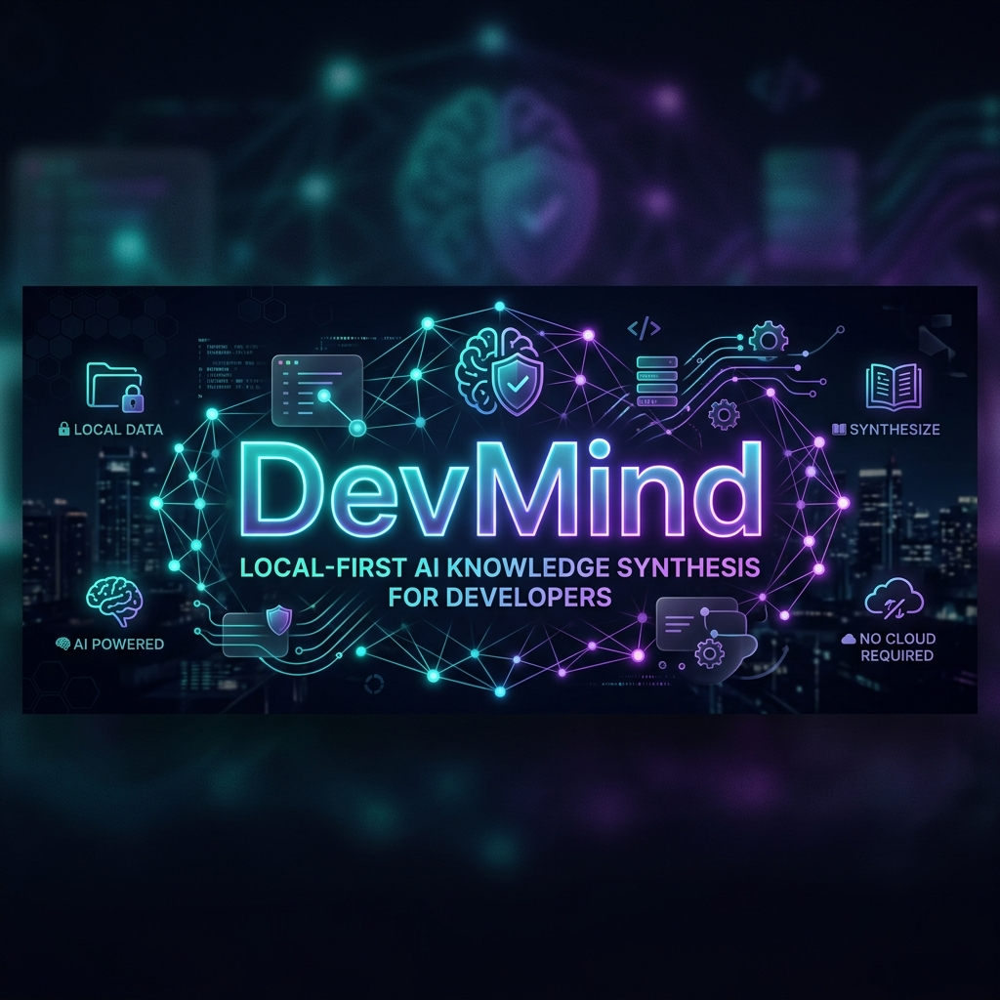
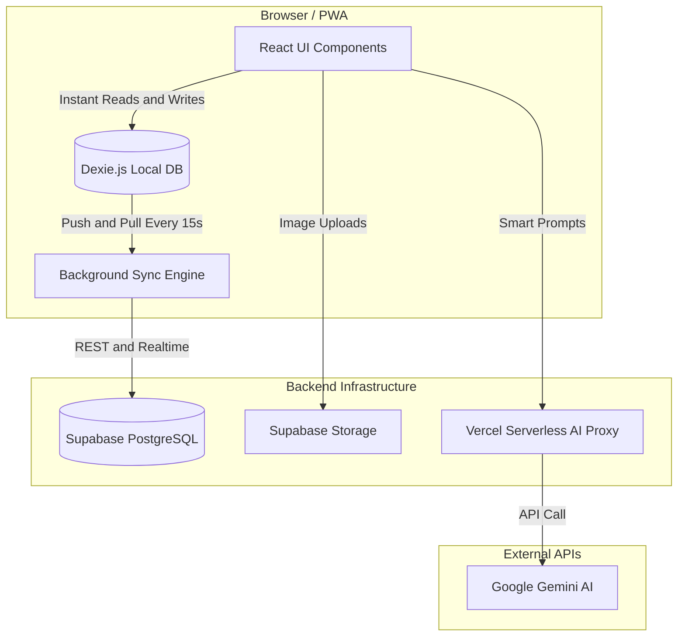

<div align="center">
  

  <br/><br/>
  
  <p align="center">
    
    
    
    
    
    
  </p>
</div>

<br/>

<div align="center">
  <blockquote>
    <b>DevMind</b> is a premium, local-first knowledge synthesis hub. It ingests the noise of the internet—messy URLs, handwritten scribbles, disjointed thoughts—and uses state-of-the-art AI to transform them into structured, interconnected, and trackable mastery.
  </blockquote>
</div>

<br/>

## 🌟 Why DevMind?

| 🚀 **Blazingly Fast (Local First)** | 🧠 **AI-Augmented Synthesis** |
| :--- | :--- |
| **Zero Latency**: Powered by `Dexie.js`, every read, write, and deletion happens instantly in your browser. <br/><br/> **Offline Ready**: Work on an airplane. DevMind silently resolves conflicts and pushes to Supabase when you reconnect. | **Talk to Your Notes**: Ask follow-ups, build quizzes, or summarize entire topics directly inside the timeline. <br/><br/> **Smart Extraction**: Paste a noisy, ad-ridden URL and watch DevMind instantly extract only the clean, readable content. |

| 📸 **Handwriting OCR Engine** | 🎨 **Premium Visual Experience** |
| :--- | :--- |
| **Whiteboards to Text**: Snap a photo of your notebook. DevMind uses **Gemini Vision AI** to perfectly transcribe and format it into your digital workspace. <br/><br/> **Editable Fallbacks**: Complete manual control if the AI misinterprets your handwriting. | **Glassmorphism UI**: A sleek, dark-mode-first aesthetic with glowing neon accents and beautifully animated drag-and-drop interactions. <br/><br/> **High-Fidelity PDF Export**: Export any topic "as-is" into a gorgeous, continuous PDF receipt. |

<br/>

## 🏗️ Architecture Under The Hood

DevMind utilizes a sophisticated local-first architecture to guarantee 100% uptime and zero latency, backed by cloud permanence.



<br/>

## 🚀 Get Started in 3 Minutes

### 1. Clone & Install
```bash
git clone https://github.com/your-username/devmind.git
cd devmind
npm install
```

### 2. Configure Your Environment
Create a `.env.local` file from the provided template:
```bash
cp .env.example .env.local
```
You will need three highly secure keys:
- `VITE_SUPABASE_URL`: Your Supabase project URL.
- `VITE_SUPABASE_ANON_KEY`: Your Supabase public anonymous key.
- `GEMINI_API_KEY`: Get a free key from [Google AI Studio](https://aistudio.google.com/apikey).

### 3. Spin Up The Database
Head over to the **SQL Editor** in your Supabase Dashboard and execute the complete schema. This sets up your tables, row-level security (RLS), and your AI Vision storage bucket instantly.

<details>
<summary><b>🔥 Click to reveal the complete SQL Schema</b></summary>

```sql
-- Topics table
create table topics (
  id text primary key,
  user_id uuid references auth.users on delete cascade not null,
  name text not null,
  colour text not null,
  collection_id text,
  mastery_percent int default 0,
  created_at timestamptz default now(),
  updated_at timestamptz default now()
);
alter table topics enable row level security;
create policy "Users own their topics" on topics for all using (auth.uid() = user_id);

-- Blocks table
create table blocks (
  id text primary key,
  user_id uuid references auth.users on delete cascade not null,
  topic_id text references topics(id) on delete cascade,
  type text not null,
  content text not null,
  source_url text,
  source_title text,
  image_url text,
  ocr_text text,
  "order" int default 0,
  is_pinned boolean default false,
  tags text[] default '{}',
  sync_status text default 'synced',
  created_at timestamptz default now(),
  updated_at timestamptz default now()
);
alter table blocks enable row level security;
create policy "Users own their blocks" on blocks for all using (auth.uid() = user_id);

-- Collections table
create table collections (
  id text primary key,
  user_id uuid references auth.users on delete cascade not null,
  name text not null,
  topic_ids text[] default '{}',
  created_at timestamptz default now()
);
alter table collections enable row level security;
create policy "Users own their collections" on collections for all using (auth.uid() = user_id);

-- Storage bucket for OCR scans
INSERT INTO storage.buckets (id, name, public) VALUES ('handwritten-scans', 'handwritten-scans', true);
CREATE POLICY "Allow authenticated uploads" ON storage.objects FOR INSERT TO authenticated WITH CHECK (bucket_id = 'handwritten-scans');
CREATE POLICY "Allow authenticated updates" ON storage.objects FOR UPDATE TO authenticated USING (bucket_id = 'handwritten-scans');
CREATE POLICY "Allow public read" ON storage.objects FOR SELECT TO public USING (bucket_id = 'handwritten-scans');
```
</details>

*Note: Make sure to enable **Email Authentication** in your Supabase Auth Providers.*

### 4. Ignite!
```bash
npm run dev
```
Open `http://localhost:5173`. DevMind will automatically proxy your AI requests through the local Vite server.

<br/>

## ☁️ Deploying to Production

DevMind leverages **Vercel Serverless Functions** to securely proxy AI requests without exposing your API keys to the client.

### One-Click GitHub Deployment (Recommended)
1. Head to [Vercel](https://vercel.com/new).
2. Import your cloned `devmind` repository.
3. Paste in your `VITE_SUPABASE_URL`, `VITE_SUPABASE_ANON_KEY`, and `GEMINI_API_KEY` into the Environment Variables section.
4. Click **Deploy**. Vercel will handle the rest, and seamlessly auto-update whenever you push to `main`.

<br/>

---

<div align="center">
  <p>Built with ❤️ and an unhealthy amount of caffeine.</p>
  <p><b>MIT License</b></p>
</div>
