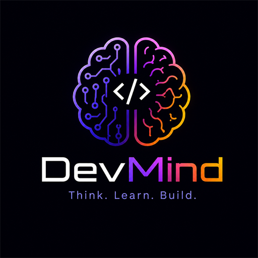

<div align="center">
  
  <h1>DevMind</h1>
  <p><strong>Your Personal Knowledge Synthesis Workspace</strong></p>
  <p>An intelligent, local-first knowledge management app with AI-powered synthesis, OCR, and automated URL extraction.</p>
</div>

---

## ✨ Features

- **⚡ Local-First & Offline Ready**: Uses `Dexie.js` for instant, offline database reads and optimistic writes. 
- **🔄 Cloud Sync**: Seamlessly syncs your knowledge base to Supabase in the background.
- **🧠 AI Synthesis (Gemini & Claude)**: Generate study notes, extract key points, and create quizzes directly from your materials.
- **📸 Handwritten OCR**: Upload photos of your handwritten notes and DevMind will extract the text automatically using Gemini Vision.
- **🔗 Smart URL Clipping**: Paste any URL, and DevMind automatically fetches and extracts the readable content, stripping out ads and noise.
- **📋 Versatile Block Types**: Build topics using rich blocks — own notes, AI responses, URL clips, YouTube videos, and handwritten scans.
- **🗂️ Collections & Mastery**: Group topics into collections and track your mastery percentage as you add more blocks.
- **📱 PWA & Mobile Optimized**: Installable as a Progressive Web App (PWA) with a dedicated mobile layout.

## 🚀 Tech Stack

- **Frontend**: React, TypeScript, Vite
- **Styling**: Tailwind CSS (v3)
- **Local DB**: Dexie.js (IndexedDB)
- **Backend & Auth**: Supabase
- **AI Proxy**: Vercel Serverless Functions
- **Drag & Drop**: `@dnd-kit/core`

---

## 🛠️ Getting Started

### 1. Clone the repository
```bash
git clone https://github.com/your-username/devmind.git
cd devmind
```

### 2. Install dependencies
```bash
npm install
```

### 3. Set up Supabase
1. Create a new project at [Supabase](https://supabase.com).
2. Go to **SQL Editor** and run the following schema to create your tables and Row Level Security (RLS) policies:

<details>
<summary><b>Click to expand SQL Schema</b></summary>

```sql
-- Topics table
create table topics (
  id text primary key,
  user_id uuid references auth.users not null,
  name text not null,
  colour text not null,
  collection_id text,
  mastery_percent int default 0,
  created_at timestamptz default now(),
  updated_at timestamptz default now()
);
alter table topics enable row level security;
create policy "Users own their topics" on topics for all using (auth.uid() = user_id);

-- Blocks table
create table blocks (
  id text primary key,
  user_id uuid references auth.users not null,
  topic_id text references topics(id) on delete cascade,
  type text not null,
  content text not null,
  source_url text,
  source_title text,
  image_url text,
  ocr_text text,
  "order" int default 0,
  is_pinned boolean default false,
  tags text[] default '{}',
  sync_status text default 'synced',
  created_at timestamptz default now(),
  updated_at timestamptz default now()
);
alter table blocks enable row level security;
create policy "Users own their blocks" on blocks for all using (auth.uid() = user_id);

-- Collections table
create table collections (
  id text primary key,
  user_id uuid references auth.users not null,
  name text not null,
  topic_ids text[] default '{}',
  created_at timestamptz default now()
);
alter table collections enable row level security;
create policy "Users own their collections" on collections for all using (auth.uid() = user_id);
```
</details>

3. In Supabase, go to **Authentication > Providers** and ensure **Email** is enabled (and Google OAuth if desired).
4. Go to **Storage > Buckets** and create a public bucket named `handwritten_scans` for OCR images.

### 4. Configure Environment Variables
Copy the template file to create your local environment variables:
```bash
cp .env.example .env.local
```
Fill in the variables in `.env.local`:
- `VITE_SUPABASE_URL` and `VITE_SUPABASE_ANON_KEY`: Find these in **Supabase Dashboard → Settings → API**.
- `GEMINI_API_KEY`: Get a free key at [Google AI Studio](https://aistudio.google.com/apikey).

### 5. Start the Development Server
```bash
npm run dev
```
Open [http://localhost:5173](http://localhost:5173) in your browser. AI features will automatically use the local Vite proxy.

---

## ☁️ Deploying to Production (Vercel)

DevMind is designed to be easily deployed to Vercel, taking advantage of their Serverless Functions for the AI proxy. The easiest way to deploy is directly from your GitHub repository.

### Option A: Deploy via GitHub (Recommended)
1. Go to [Vercel](https://vercel.com/new) and log in.
2. Click **Import** next to your `devmind` GitHub repository.
3. In the **Environment Variables** section, add your 3 required keys:
   - `VITE_SUPABASE_URL`
   - `VITE_SUPABASE_ANON_KEY`
   - `GEMINI_API_KEY`
4. Click **Deploy**. Vercel will automatically build the app and deploy it. It will also auto-update every time you push to the `main` branch.

### Option B: Deploy via Vercel CLI
1. Install the Vercel CLI:
```bash
npm i -g vercel
```
2. Link and deploy your project (you must add env vars in the Vercel Dashboard afterwards):
```bash
vercel
```
3. Once configured, deploy to production:
```bash
vercel --prod
```

## 📜 License
MIT License
