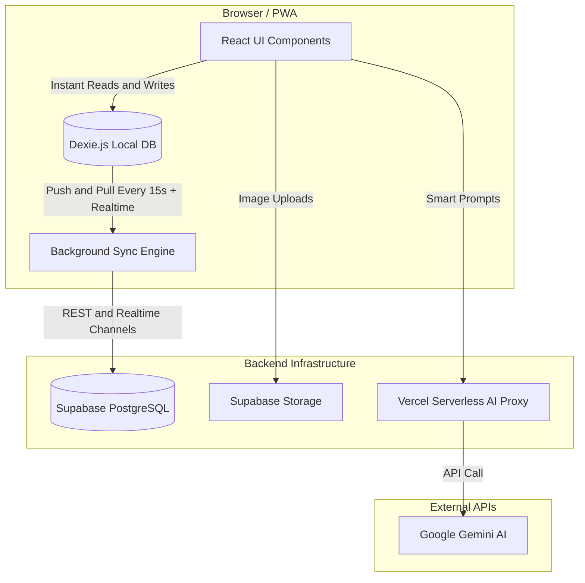

<div align="center">
  

  <br/><br/>

  <p align="center">
    
    
    
    
    
    
  </p>

  <p align="center">
    
    
    
    
  </p>
</div>

<br/>

<div align="center">
  <h3>🧠 The dumping ground for your half-finished thoughts.<br/>The whiteboard that actually remembers.</h3>
  <p>
    <b>DevMind</b> is a premium, local-first knowledge synthesis hub. It ingests the noise of the internet —<br/>
    messy URLs, handwritten scribbles, disjointed thoughts — and uses AI to transform them into<br/>
    structured, interconnected, exportable knowledge. Offline-first. Yours to keep.
  </p>
</div>

<div align="center">
  <sub>
    <a href="#-why-devmind">Why DevMind</a> ·
    <a href="#-the-stack">Stack</a> ·
    <a href="#-get-started-in-3-minutes">Quick Start</a> ·
    <a href="#%EF%B8%8F-deploying-to-production">Deploy</a> ·
    <a href="#%EF%B8%8F-roadmap">Roadmap</a> ·
    <a href="#-faq">FAQ</a>
  </sub>
</div>

<br/>

---

## 🌟 Why DevMind?

| 🚀 **Blazingly Fast (Local‑First)** | 🧠 **AI‑Augmented Synthesis** |
| :--- | :--- |
| **Zero Latency** — Powered by `Dexie.js`, every read, write, and deletion happens instantly in your browser, before the network is even touched. <br/><br/> **Offline Ready** — Work on an airplane. DevMind queues your changes locally and silently syncs to Supabase the moment you reconnect, in real time. | **Talk to Your Notes** — Ask follow-up questions, request a synthesis, or summarize an entire topic directly inside the timeline. <br/><br/> **Smart Extraction** — Paste a noisy, ad-ridden URL or a YouTube link and watch DevMind pull out only the clean, readable content. |

| 📸 **Handwriting OCR Engine** | 🎨 **Premium Visual Experience** |
| :--- | :--- |
| **Whiteboard → Text** — Snap a photo of your notebook. DevMind uses Gemini Vision to transcribe and format it straight into your digital workspace. <br/><br/> **Editable Fallback** — Full manual control if the AI misreads your handwriting — nothing is ever locked. | **Dark-Mode-First UI** — A sleek, glassmorphic aesthetic with glowing accents and fluid drag-and-drop reordering. <br/><br/> **High-Fidelity PDF Export** — Export any topic, exactly as you built it, into a clean, continuous PDF. |

<br/>

### 🧩 Block types

Every piece of knowledge in DevMind lives on the canvas as a **block** — drag, pin, and reorder freely. Each type carries its own colour-coded left border, so a glance at the timeline tells you what kind of thinking happened where.

<table>
<tr>
<td width="50%">

#### 📝 Note


Your own freeform thoughts, typed straight onto the canvas. No AI, no fetch — just you and the page.

</td>
<td width="50%">

#### 🔗 URL Clip


Paste any link. DevMind strips ads and chrome via the AI proxy and keeps only the readable signal — title, domain, and clean body text.

</td>
</tr>
<tr>
<td width="50%">

#### ▶️ YouTube Note


Drop a YouTube URL to anchor a video alongside your own notes on it — context and commentary, side by side.

</td>
<td width="50%">

#### ✍️ Handwritten Scan


Photograph a notebook page. Uploaded straight to Supabase Storage, then transcribed by **Gemini Vision** — fully searchable, fully editable.

</td>
</tr>
<tr>
<td width="50%">

#### 🤖 AI Response


Ask a direct question and get an answer, anchored permanently in the topic timeline — no separate chat window to lose track of.

</td>
<td width="50%">

#### 🧬 Synthesis


The "aha" block. Ask AI to weave every other block in the topic into one coherent, personal-voice summary — with a subtle teal-tinted background to mark it as the conclusion.

</td>
</tr>
</table>

<br/>

### 🎨 Design tokens

DevMind ships a deliberate, dark-mode-first palette — no default Tailwind grays in sight. Every surface, border, and accent is hand-tuned:

<div align="center">

| | | | | | |
|:---:|:---:|:---:|:---:|:---:|:---:|
|  |  |  |  |  |  |

</div>

<details>
<summary><b>🎨 Click to see the full token table (backgrounds, borders, text)</b></summary>

<br/>

**Backgrounds**

| Token | Hex | Usage |
| :--- | :--- | :--- |
| `bg-base` | `#0D0D0F` | App canvas background |
| `bg-surface` | `#141416` | Sidebar, panels |
| `bg-card` | `#1C1C20` | Block cards |
| `bg-hover` | `#242428` | Hover states |

**Borders**

| Token | Hex | Usage |
| :--- | :--- | :--- |
| `border-subtle` | `#1E1E24` | Faint dividers |
| `border` (default) | `#2A2A30` | Standard component borders |
| `border-strong` | `#3A3A44` | Emphasized borders, neutral note blocks |

**Text**

| Token | Hex | Usage |
| :--- | :--- | :--- |
| `text-muted` | `#52525E` | Disabled / least important |
| `text-subtle` | `#6B6B7A` | Secondary labels |
| `text-body` | `#C8C8D4` | Default body copy |
| `text-primary` | `#F0F0F4` | Headings, emphasis |

**Accents**

| Token | Hex | Used by |
| :--- | :--- | :--- |
| `accent-purple` | `#7C6AF7` | AI Response blocks, primary buttons |
| `accent-purple2` | `#9D8FFF` | Purple gradient endpoint |
| `accent-amber` | `#F0904D` | Handwritten scan blocks |
| `accent-teal` | `#3ECFAD` | Synthesis blocks |
| `accent-red` | `#E05C5C` | Destructive actions, delete |
| `accent-green` | `#4DB87A` | Success / sync confirmations |

**Type**

| Token | Font |
| :--- | :--- |
| `font-sans` | Inter, system-ui |
| `font-mono` | JetBrains Mono, Fira Code |

</details>

<br/>

## 🌌 The Vision

DevMind isn't trying to be a note-taking app. It's trying to be the place where research stops being scattered across seventeen browser tabs and a notebook you'll lose by Tuesday. Local-first means it's *yours* — no spinner, no "loading your workspace," no dependency on a server being awake. Cloud sync means it follows you anyway.

<br/>

## 🏗️ Architecture Under The Hood

DevMind utilizes a sophisticated local-first architecture to guarantee 100% uptime and zero latency, backed by cloud permanence. Reads and writes never wait on a network round-trip — Supabase exists to back you up, not to gate you.



> 💡 **Local-first, not local-only.** Every write lands in IndexedDB first — instantly — then gets queued for Supabase. Realtime subscriptions push changes from other devices back down without you ever hitting reload.

<br/>

### 📦 The Stack

<div align="center">

| Layer | Technology | Why |
| :---: | :--- | :--- |
| 🎨 **UI** | React `19.2` + TypeScript `6.0` | Strict types end-to-end, latest React concurrent features |
| 💅 **Styling** | Tailwind CSS `3.4` | Custom dark-mode token system (see palette above) |
| 🗄️ **Local DB** | Dexie.js `4.4` (IndexedDB) | Instant reads/writes, offline-first by default |
| ☁️ **Cloud DB** | Supabase (PostgreSQL + Realtime + Auth) | RLS-secured, WebSocket sync, free tier friendly |
| 🖱️ **Drag & Drop** | `@dnd-kit` `6.3` / `10.0` | Accessible, touch-aware sortable blocks |
| 🐻 **State** | Zustand `5.0` | No boilerplate, no providers, just a store |
| 📄 **PDF Export** | jsPDF `2.5` | Client-side, no server round-trip needed |
| ⚡ **Build** | Vite `8.1` + `vite-plugin-pwa` | Installable PWA, instant HMR |
| ☁️ **Hosting** | Vercel Serverless Functions | API keys never touch the client bundle |

</div>

<br/>

## 🚀 Get Started in 3 Minutes

<table>
<tr>
<td width="33%" valign="top">

### `1` Clone & Install

```bash
git clone https://github.com/BlueByteRAMbo/DevMind.git
cd DevMind
npm install
```

</td>
<td width="33%" valign="top">

### `2` Configure

```bash
cp .env.example .env.local
```

Fill in your Supabase + Gemini keys (see below).

</td>
<td width="33%" valign="top">

### `3` Ignite

```bash
npm run dev
```

Open `http://localhost:5173` 🎉

</td>
</tr>
</table>

<br/>

### 🔑 Environment Variables

You'll need three keys — all free to obtain:

| Variable | Where to get it |
| :--- | :--- |
| `VITE_SUPABASE_URL` | Your [Supabase](https://supabase.com/dashboard) project → Settings → API |
| `VITE_SUPABASE_ANON_KEY` | Same page — the public anonymous key |
| `GEMINI_API_KEY` | [Google AI Studio](https://aistudio.google.com/apikey) — free tier available |

<br/>

### 🗄️ Spin Up The Database
Head over to the **SQL Editor** in your Supabase Dashboard and execute the complete schema. This sets up your tables, row-level security (RLS), and your AI Vision storage bucket instantly.

<details>
<summary><b>🔥 Click to reveal the complete SQL Schema</b></summary>

```sql
-- Topics table
create table topics (
  id text primary key,
  user_id uuid references auth.users on delete cascade not null,
  name text not null,
  colour text not null,
  collection_id text,
  mastery_percent int default 0,
  created_at timestamptz default now(),
  updated_at timestamptz default now()
);
alter table topics enable row level security;
create policy "Users own their topics" on topics for all using (auth.uid() = user_id);

-- Blocks table
create table blocks (
  id text primary key,
  user_id uuid references auth.users on delete cascade not null,
  topic_id text references topics(id) on delete cascade,
  type text not null,
  content text not null,
  source_url text,
  source_title text,
  image_url text,
  ocr_text text,
  "order" int default 0,
  is_pinned boolean default false,
  tags text[] default '{}',
  sync_status text default 'synced',
  created_at timestamptz default now(),
  updated_at timestamptz default now()
);
alter table blocks enable row level security;
create policy "Users own their blocks" on blocks for all using (auth.uid() = user_id);

-- Collections table
create table collections (
  id text primary key,
  user_id uuid references auth.users on delete cascade not null,
  name text not null,
  topic_ids text[] default '{}',
  created_at timestamptz default now()
);
alter table collections enable row level security;
create policy "Users own their collections" on collections for all using (auth.uid() = user_id);

-- Storage bucket for OCR scans
INSERT INTO storage.buckets (id, name, public) VALUES ('handwritten-scans', 'handwritten-scans', true);
CREATE POLICY "Allow authenticated uploads" ON storage.objects FOR INSERT TO authenticated WITH CHECK (bucket_id = 'handwritten-scans');
CREATE POLICY "Allow authenticated updates" ON storage.objects FOR UPDATE TO authenticated USING (bucket_id = 'handwritten-scans');
CREATE POLICY "Allow public read" ON storage.objects FOR SELECT TO public USING (bucket_id = 'handwritten-scans');
```
</details>

> ⚠️ Don't forget to enable **Email Authentication** under Supabase → Authentication → Providers, or sign-in will fail silently.

<br/>

## ☁️ Deploying to Production

DevMind leverages **Vercel Serverless Functions** to securely proxy AI requests without ever exposing your API keys to the client.

### One-Click GitHub Deployment (Recommended)

1. Head to [Vercel](https://vercel.com/new).
2. Import your cloned `DevMind` repository.
3. Paste `VITE_SUPABASE_URL`, `VITE_SUPABASE_ANON_KEY`, and `GEMINI_API_KEY` into Environment Variables.
4. Click **Deploy**. Vercel auto-rebuilds on every push to `main` — no further setup needed.

<br/>

## 🗺️ Roadmap

<table>
<tr><th width="30%">🎯 Theme</th><th>Planned</th></tr>
<tr>
<td>🤖 <b>AI Providers</b></td>
<td>

- [ ] OpenAI support alongside Gemini & Claude
- [ ] Groq for low-latency inference
- [ ] Local Ollama for fully offline AI

</td>
</tr>
<tr>
<td>📱 <b>Mobile UX</b></td>
<td>

- [ ] Touch-friendly drag handles (always visible, not hover-only)
- [ ] Bottom-sheet block details panel
- [ ] Larger tap targets across the canvas

</td>
</tr>
<tr>
<td>⚡ <b>Quick Capture</b></td>
<td>

- [ ] Always-floating camera button for instant handwritten scans
- [ ] One-tap capture → upload → OCR pipeline

</td>
</tr>
<tr>
<td>🤝 <b>Collaboration</b></td>
<td>

- [ ] Shared, multi-user topics
- [ ] Tag-based cross-topic search

</td>
</tr>
</table>

Have an idea? [Open an issue](../../issues) — this list grows with the community.

<br/>

## ❓ FAQ

<details>
<summary><b>Is my data private?</b></summary>
<br/>
Yes. Every table in Supabase is protected by Row-Level Security — your <code>user_id</code> gates every read and write at the database level, not just in the UI. Locally, everything lives in your browser's IndexedDB until you choose to sync.
</details>

<details>
<summary><b>Does it work offline?</b></summary>
<br/>
Completely. DevMind is a PWA with a local-first Dexie.js layer underneath — create topics, add blocks, reorder, even export PDFs with zero connection. Sync resumes automatically the moment you're back online.
</details>

<details>
<summary><b>What happens if I edit the same topic on two devices at once?</b></summary>
<br/>
Last-write-wins, compared by <code>updated_at</code> timestamp. Realtime subscriptions mean both devices typically converge within a second or two of either one saving.
</details>

<details>
<summary><b>Can I self-host instead of using Supabase Cloud?</b></summary>
<br/>
Yes — Supabase is open-source and can be self-hosted. Point <code>VITE_SUPABASE_URL</code> at your own instance and everything else works unchanged.
</details>

<br/>

## 🤝 Contributing

Contributions are very welcome. Fork the repo, create a feature branch, and open a PR — small, focused changes are easiest to review and merge fast.

```bash
git checkout -b feature/your-idea
# make your changes
git commit -m "feat: short description"
git push origin feature/your-idea
```

<br/>

---

<div align="center">
  
  <br/><br/>
  <p>Built with ❤️ and an unhealthy amount of caffeine.</p>
  <p><b>MIT License</b> — free to use, fork, and remix.</p>
  <sub>⭐ If DevMind saved you from fifty browser tabs, consider starring the repo.</sub>
</div>